# Bestiary Arena Mod Loader

A browser extension that allows loading and managing custom mods for the Bestiary Arena game. This extension provides a framework for creating, loading, and managing mods that can extend the game's functionality.

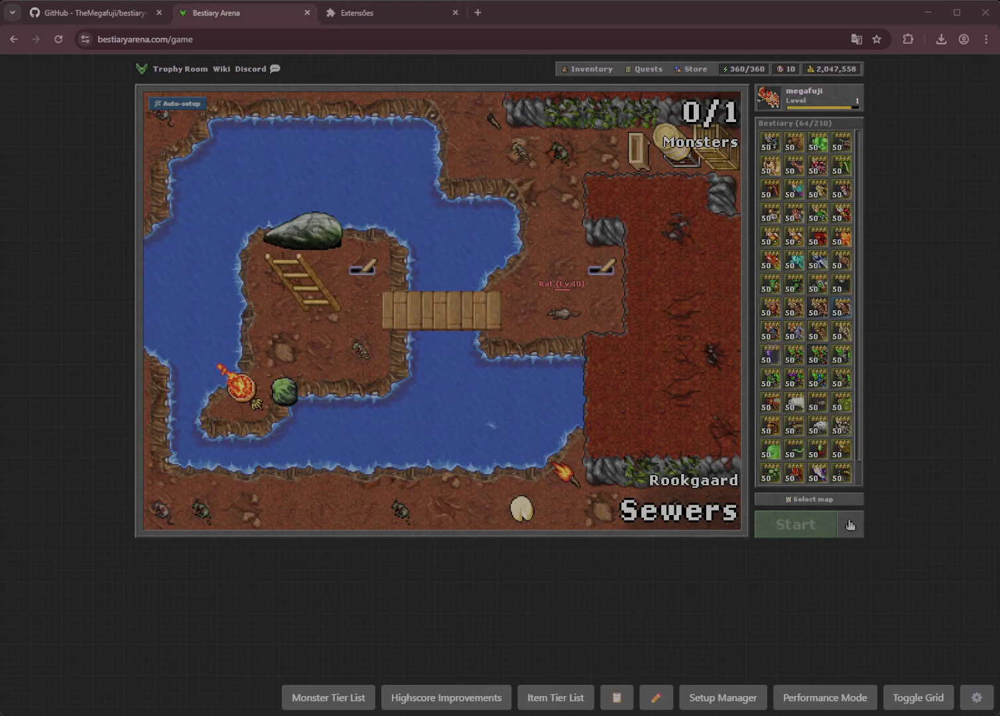

## Features

- **Mod Management**: Load mods from local files or GitHub Gists
- **Configuration System**: Save and manage mod configurations between sessions
- **Standardized UI Components**: Game-styled UI elements for consistency across mods
- **Internationalization**: Built-in translation support for mods
- **Game API Access**: Safe access to game state and functions
- **Developer-Friendly**: Comprehensive documentation and examples

## Installation

1. Clone this repository or download it as a ZIP file
2. Open Chrome and navigate to `chrome://extensions/`
3. Enable "Developer mode" (toggle in the upper right)
4. Click "Load unpacked" and select the directory containing this extension

## Using the Mod Loader

After installing the extension, navigate to [Bestiary Arena](https://bestiaryarena.com/). The extension will automatically inject its code into the game page.

To access the Mod Loader interface, click the extension icon in your browser toolbar.

### Extension Popup Interface

The extension provides a user-friendly popup interface for managing your mods:

| Extension Popup Interface |  |
|-------------|----------------------|
| 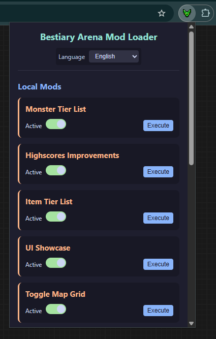 | 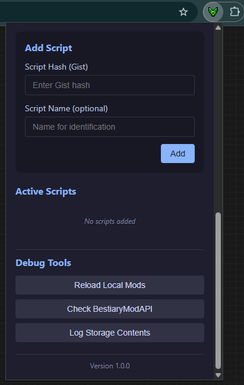 |

The popup interface allows you to enable/disable mods and access configuration options quickly.

### Loading Mods

There are two ways to load mods:

1. **Local Mods**: Place mod JavaScript files in the `mods/` directory and they will be available for loading.
2. **Gist Mods**: Enter a GitHub Gist hash ID in the mod loader interface to load a mod from GitHub.

### Managing Mods

You can enable, disable, and configure mods from the mod loader interface. Each mod can have its own configuration settings, which are saved between sessions.

## Mod Development

Mods can be written in JavaScript and have access to the game's state and a powerful API for interacting with the game. See the [Mod Development Guide](docs/mod_development_guide.md) for detailed information on creating mods.

### Basic Mod Template

Here's a simple example of a mod:

```javascript
// My First Mod
console.log('My First Mod initializing...');

// Create a button in the UI
api.ui.addButton({
  id: 'my-first-mod-button',
  text: 'My Mod',
  tooltip: 'Click to show a message',
  primary: false,
  onClick: function() {
    api.ui.components.createModal({
      title: 'My First Mod',
      content: '<p>Hello from my first mod!</p>',
      buttons: [
        {
          text: 'OK',
          primary: true
        }
      ]
    });
  }
});

console.log('My First Mod initialization complete');
```

### Standardized UI Components

The extension provides a set of UI components that match the game's style. These components ensure a consistent look and feel across all mods:

- **Modals**: Game-styled dialog windows
- **Scrollable Containers**: For content that exceeds the viewable area
- **Monster Portraits**: Display monsters with proper styling
- **Item Portraits**: Display items with proper styling
- **Room List Items**: Display rooms with proper styling
- **Navigation Breadcrumbs**: For hierarchical navigation

Example of using UI components:

```javascript
// Create a monster portrait
const monsterPortrait = api.ui.components.createMonsterPortrait({
  monsterId: 21,  // Monster ID
  level: 50,      // Monster level
  tier: 4,        // Monster tier (1-5)
  onClick: () => showMonsterDetails(21)
});
```

### Access to Game State

Mods have access to the game's state through `globalThis.state`, which provides information about:

- Player stats and inventory
- Monster database and current monsters
- Equipment and items
- Game board state
- Room information
- Game settings

## Project Structure

- `assets/` - Static assets such as fonts, icons, and scripts
  - `fonts/` - Custom fonts used by the UI components
  - `icons/` - Icons used by the extension and mods
  - `js/` - JavaScript libraries, including UI components
  - `locales/` - Internationalization files
- `content/` - Content scripts that are injected into the game page
  - `client.js` - Main client-side API and functionality
  - `injector.js` - Injects the client code into the game page
  - `local_mods.js` - Manages local mods
- `docs/` - Documentation for mod developers
- `mods/` - Local mod files
- `popup/` - Extension popup UI
- `background.js` - Background script for the extension
- `manifest.json` - Extension manifest

## Documentation

- [Mod Development Guide](docs/mod_development_guide.md) - Comprehensive guide for mod developers
- [UI Management API](docs/ui_management.md) - Documentation for the UI Management API
- [UI Components Documentation](docs/ui_components.md) - Documentation for the UI Components
- [Client API Documentation](docs/client_api.md) - Complete reference for the game's Client API
- [Game State API Documentation](docs/game_state_api.md) - Complete reference for accessing and modifying game state

## Example Mods

The extension comes with several powerful example mods that demonstrate different features:

### UI Components Showcase
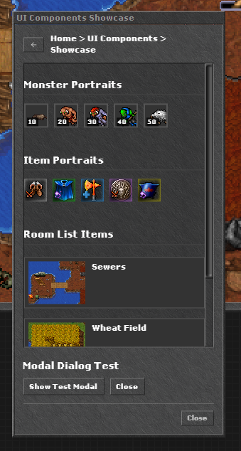

Demonstrates all available UI components provided by the mod loader, allowing developers to see how components look and function within the game's environment. Includes examples of monster portraits, item portraits, room list items, and modals with proper styling.

### Custom Display
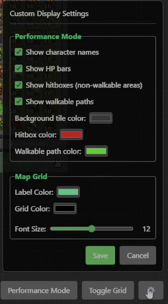

Enhances game visuals with two powerful features:
- **Performance Mode**: Strips down graphics for better performance on low-end devices.
  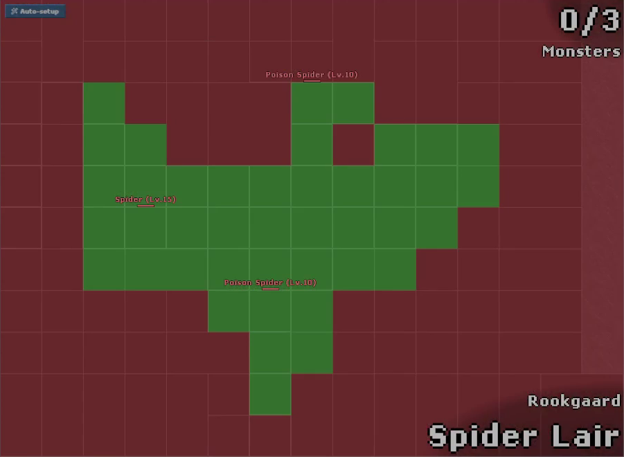
- **Map Grid**: Adds a coordinate grid overlay to help with positioning and planning.
  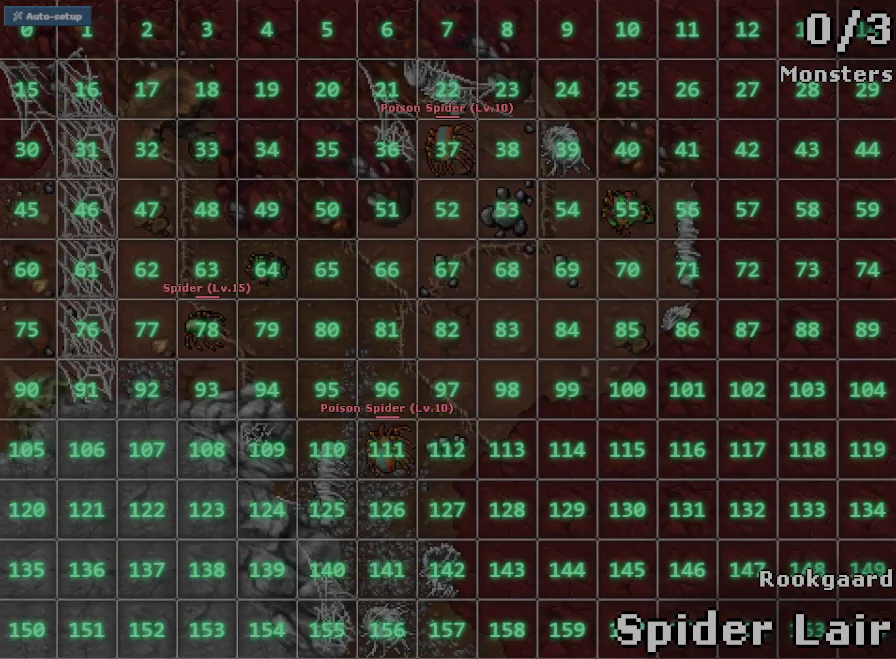

Both features can be customized with extensive settings for colors, visibility, and display options.

### Hero Editor
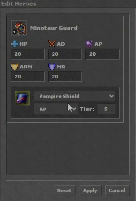

A powerful tool that allows players to:
- Edit monster stats directly in the game
- Modify equipment attributes (stat type, tier)
- Apply changes instantly to the game board
- Save and load custom setups

Perfect for testing different monster and equipment combinations without having to collect and level them in-game.

### Setup Manager
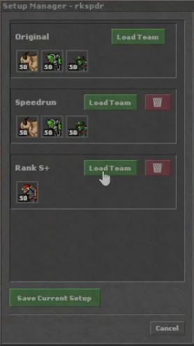

Allows players to save, load, and manage team configurations for different maps. Features include:
- Multiple saved team setups per map
- Easy switching between configurations
- Automatic detection of map changes
- Custom naming of team configurations
- Integration with the game's auto-configure button

### Team Copier
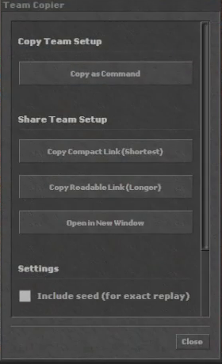

Enables sharing team configurations with other players through:
- Copying team setup as JSON command
- Generating sharable links (compact or readable)
- Opening shared configurations in new windows
- Optional inclusion of game seeds for exact replays
- History of recently used seeds

### Monster Tier List
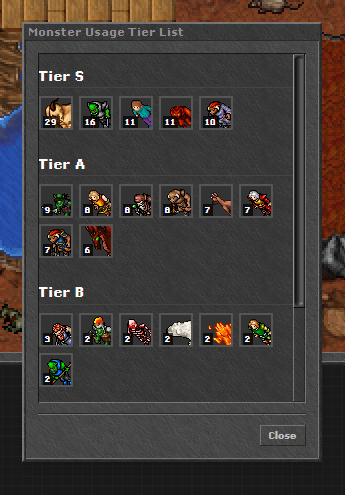

Analyzes monster usage patterns and displays statistics and rankings, helping players identify the most effective monsters for different scenarios. Features include:
- Sortable tier list of monsters
- Usage statistics across different room types
- Win rate and performance metrics
- Visual representation of monster effectiveness

### Item Tier List
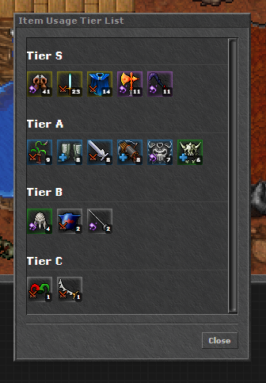

Displays equipment statistics and rankings, allowing players to compare items and make informed decisions about their loadouts. The mod shows:
- Item effectiveness by tier
- Stat optimizations for different monsters
- Best-in-slot recommendations
- Visual quality indicators

### Highscore Improvements
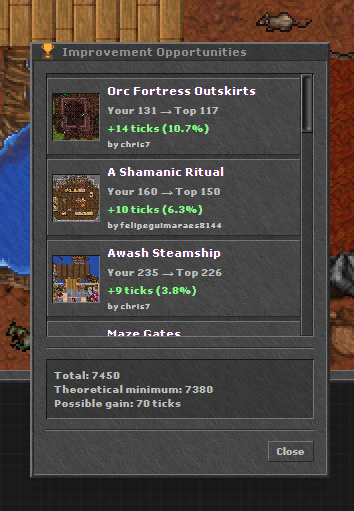

Enhances the game's highscore display with additional statistics, improved sorting options, and visual enhancements. Features include:
- Detailed performance analysis
- Potential time improvements compared to top scores
- Room-by-room breakdown of performance
- Visual indicators for time differences

## Contributing

Contributions are welcome! If you have a mod you'd like to share or improvements to the extension, please read our [Contribution Guidelines](CONTRIBUTING.md).

## License

This project is licensed under the MIT License. See the LICENSE file for details. 